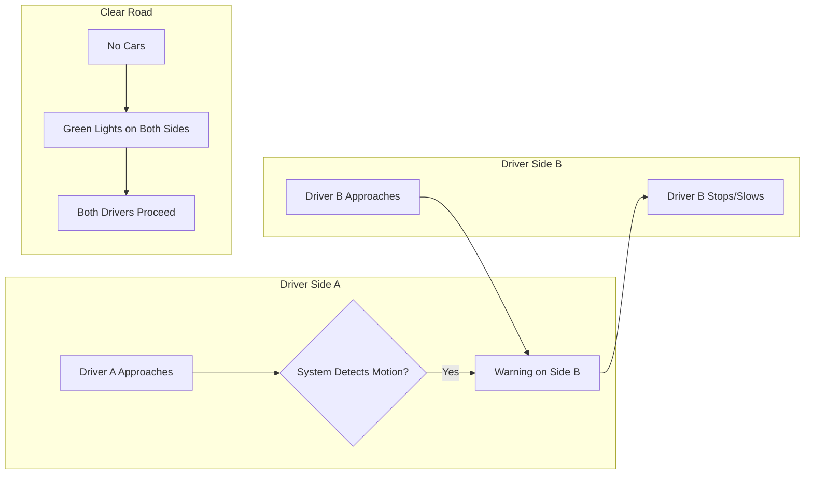

<div align="center">

# 🚦 U-Turn Guardians
### Smart Road Safety System for U-Turns and Sharp Bends

[](https://isocpp.org/)
[](https://www.arduino.cc/)
[](https://github.com/FlemingJohn/U-Turn-Guardians)
[](https://opensource.org/licenses/MIT)

**Reducing accidents and saving lives through intelligent road safety interventions.**

[Features](#-key-features) • [Installation](#-installation-and-setup) • [How It Works](#-how-it-works) • [System Architecture](#-system-architecture)

</div>

---

## 📖 Project Overview

### Problem Statement
Unpredictable accidents at U-turns and bends lead to frequent injuries, fatalities, and property damage. Traditional mirrors and signage are often insufficient due to blind spots, poor visibility, or driver negligence.

### Our Solution
**U-Turn Guardians** is an intelligent monitoring system that tracks vehicles in high-risk areas using sensors and immediate visual alerts.
- **Proactive:** Detects vehicles *before* they enter the danger zone.
- **Reactive:** Flashes warning lights to oncoming traffic on the other side.
- **Idle State:** Maintains a safe (green) signal when no traffic is detected to keep flow moving.

---

## 🌟 Key Features

- **Real-time Vehicle Detection:** Uses PIR (Passive Infrared) sensors to detect motion instantly.
- **Cross-Alerting Mechanism:** If a car is detected on Side A, the system warns drivers on Side B.
- **Emergency Response Integration:** (Planned) Alerting nearby medical aid for rapid response.
- **Low Cost & Efficient:** Built on Arduino Nano, making it affordable for widespread deployment.

---

## 🏗 System Architecture


### System Architecture
The system employs a "Cross-Alerting" logic where sensors on one side trigger alerts on the opposite side.
- **Sensor 1 (Side A)** detects a vehicle -> **Red LED 2 (Side B)** blinks to warn oncoming traffic.
- **Sensor 2 (Side B)** detects a vehicle -> **Red LED 1 (Side A)** blinks.
- **No Detection** -> Both sides show **Green** (Safe).

```mermaid
graph TD
    A[Start] --> B{Motion at Sensor 1?}
    B -- Yes --> C[Blink Red LED 2 <br/>(Warn Side 2)]
    C --> D[Turn OFF Red LED 1]
    B -- No --> E{Motion at Sensor 2?}
    E -- Yes --> F[Blink Red LED 1 <br/>(Warn Side 1)]
    F --> G[Turn OFF Red LED 2]
    E -- No --> H[Blink Both Green LEDs <br/>(Safe to Proceed)]
    H --> B
```

### User Flow


---

## 🛠 Hardware & Software

### Hardware
- **Microcontroller:** Arduino Nano
- **Sensors:** 2x PIR Motion Sensors
- **Indicators:** LED Lights (Red & Green)
- **Circuit:** Bredboard, Resistors, Jumper Wires

### Software
- **IDE:** Arduino IDE
- **Language:** C++
- **Simulation:** TinkerCad

---

## 🚀 Installation and Setup

### 1. Circuit Connection

#### Simulation View
This 3D view shows the physical placement of components on the breadboard, making it easier to visualize the wiring.


#### Schematic View
This schematic provides a clear view of the pin connections for exact wiring.


**Pin Connections:**
- **PIR 1:** Pin 2
- **PIR 2:** Pin 3
- **Green LEDs:** Pins 8 & 10
- **Red LEDs:** Pins 9 & 13

### 2. Code Upload
1. Open the [u_turn.ino](./Smart%20Accident%20Prevention%20and%20Emergency%20Alert%20System%20for%20U-Turns%20and%20Bends/Arduino%20Nano%20code/u_turn.ino) file in Arduino IDE.
2. Select your board: `Tools > Board > Arduino Nano`.
3. Select your port: `Tools > Port > COMx`.
4. Click **Upload**.

---

## ⚙ How It Works

1. **Monitoring:** The system continuously reads data from two PIR sensors placed at opposite ends of a U-turn or bend.
2. **Detection & Logic:**
   - **Case 1 (Car at Side A):** Sensor 1 triggers. The system immediately flashes the **Red LED on Side B** to warn oncoming drivers to stop or slow down.
   - **Case 2 (Car at Side B):** Sensor 2 triggers. The system flashes the **Red LED on Side A**.
   - **Case 3 (Clear Road):** If no motion is detected on either side, **Green LEDs** blink on both sides to indicate the path is clear.
3. **Safety Loop:** This loop runs indefinitely, ensuring real-time responsiveness.

---

## 🔮 Future Scope
- **AI Integration:** Using Computer Vision (YOLO) for more accurate vehicle classification.
- **IoT Connectivity:** sending crash alerts to cloud dashboards for traffic analysis.
- **Solar Power:** Making the units self-sufficient for remote highways.

---

## 🤝 Competitors & Differentiation
| Competitor | Our Solution |
| :--- | :--- |
| Standard Mirrors | Active LED alerts (visible at night/fog) |
| Static Signage | Dynamic real-time warnings |
| Traffic Control Centre | Localized, instant standalone response |

---

## 📜 License
This project is licensed under the [MIT License](https://opensource.org/licenses/MIT).
