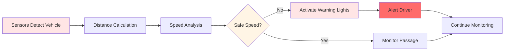
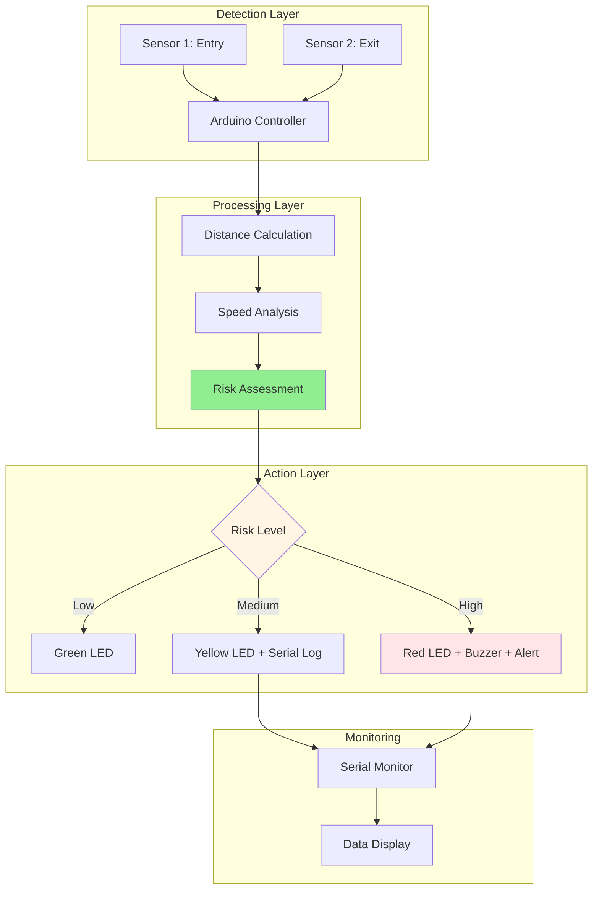

<div align="center">

# 🚦 U-Turn Guardians

### Smart Road Safety System for U-Turns and Sharp Bends

[](https://isocpp.org/)
[](https://www.arduino.cc/)
[](https://github.com/FlemingJohn/U-Turn-Guardians)
[](https://opensource.org/licenses/MIT)

**Reducing accidents and saving lives through intelligent road safety interventions**

[Features](#-key-features) • [Technology](#-technology-stack) • [Installation](#-installation) • [How It Works](#-how-it-works)

</div>

---

## 🚨 The Problem

### Road Safety Crisis at U-Turns

U-turns and sharp bends are among the most dangerous sections of roadways, accounting for a disproportionate number of traffic accidents:

**Critical Statistics:**
- 🚗 **30-40% of accidents** occur at U-turns and sharp bends
- ⚠️ **Higher fatality rates** due to head-on collisions and rollovers
- 🌙 **Night-time risks** increase by 60% due to poor visibility
- 📈 **Growing problem** with increasing traffic density

**Root Causes:**
1. **Poor Visibility** - Blind spots and obstructed views
2. **Speed Management** - Drivers failing to reduce speed appropriately
3. **Lack of Warning** - Insufficient advance warning systems
4. **Weather Conditions** - Reduced visibility in fog, rain, or darkness
5. **Driver Awareness** - Distraction and lack of attention at critical points

---

## 💡 Our Solution

**U-Turn Guardians** is an intelligent, embedded system that provides real-time warnings to prevent accidents at dangerous road sections using sensor-based detection and visual alerts.

### How It Works



### System Components

**Hardware:**
- 🔍 **Ultrasonic Sensors** - Vehicle detection and distance measurement
- 💡 **LED Warning System** - Visual alerts for approaching drivers
- 🔊 **Audio Alerts** - Sound warnings for critical situations
- ⚡ **Arduino Controller** - Central processing unit
- 🔋 **Power Supply** - Battery-powered for reliability

**Software:**
- 🤖 **Speed Calculation** - Real-time speed analysis using dual sensors
- 📊 **Data Logging** - Local incident tracking via serial monitor
- ⚙️ **Embedded Logic** - C++ firmware for Arduino
- 🎯 **Risk Assessment** - Automatic warning level determination

---

## ✨ Key Features

### 🎯 Real-Time Detection
- **Continuous Monitoring** - 24/7 vehicle detection at critical points
- **Distance Tracking** - Precise measurement of approaching vehicles
- **Speed Calculation** - Real-time speed analysis using dual sensors
- **Multi-Vehicle Handling** - Simultaneous tracking of multiple vehicles

### ⚠️ Intelligent Warning System
- **Adaptive Alerts** - Warning intensity based on vehicle speed
- **Visual Indicators** - Bright LED warnings visible from 200+ meters
- **Audio Warnings** - Sound alerts for excessive speed
- **Progressive Alerts** - Escalating warnings as danger increases

### 📊 Data Monitoring
- **Serial Output** - Real-time data display via serial monitor
- **Speed Logging** - Record of vehicle speeds
- **Event Tracking** - Log of warning activations
- **System Diagnostics** - Status monitoring

---

## 🛠️ Technology Stack

**Embedded Systems:**
- **Microcontroller:** Arduino Uno/Mega
- **Language:** C++ (Arduino Framework)
- **Sensors:** HC-SR04 Ultrasonic Sensors (2x)
- **Output:** LED Arrays, Piezo Buzzer

**Hardware Components:**
- Arduino Uno/Mega Board
- HC-SR04 Ultrasonic Distance Sensors (2x)
- High-Intensity LEDs (Red, Yellow, Green)
- Piezo Buzzer / Speaker
- Resistors (220Ω for LEDs)
- Power Supply (9V Battery / 12V Adapter)
- Breadboard & Jumper Wires
- Weather-Proof Enclosure (for deployment)

**Development Tools:**
- **IDE:** Arduino IDE
- **Libraries:** NewPing (for ultrasonic sensors)
- **Debugging:** Serial Monitor
- **Version Control:** Git

---

## 🚀 Installation

### Hardware Setup

**Required Components:**
```
1. Arduino Uno/Mega (1x)
2. HC-SR04 Ultrasonic Sensors (2x)
3. LEDs - Red, Yellow, Green (1x each)
4. Piezo Buzzer (1x)
5. Resistors 220Ω (3x for LEDs)
6. Power Supply (9V Battery or 12V Adapter)
7. Breadboard & Jumper Wires
```

### Circuit Diagram

```
Sensor 1 (Entry Point)          Arduino Uno          Sensor 2 (Exit Point)
    VCC -----------------> 5V
    GND -----------------> GND
    TRIG ----------------> Pin 2
    ECHO ----------------> Pin 3
                                                           VCC -------> 5V
                                                           GND -------> GND
                                                           TRIG ------> Pin 4
                                                           ECHO ------> Pin 5

LED System                      Arduino Uno
    Red LED -------------> Pin 8 (via 220Ω resistor)
    Yellow LED ----------> Pin 9 (via 220Ω resistor)
    Green LED -----------> Pin 10 (via 220Ω resistor)
    Buzzer --------------> Pin 11
```

### Software Installation

```bash
# 1. Clone the repository
git clone https://github.com/FlemingJohn/U-Turn-Guardians.git
cd U-Turn-Guardians

# 2. Install Arduino IDE
# Download from: https://www.arduino.cc/en/software

# 3. Install Required Libraries
# In Arduino IDE: Tools > Manage Libraries
# Search and install: "NewPing"

# 4. Open the sketch
# File > Open > U-Turn-Guardians.ino

# 5. Upload to Arduino
# Select Board: Tools > Board > Arduino Uno
# Select Port: Tools > Port > (Your Arduino Port)
# Click Upload button
```

---

## 📋 Configuration

### System Parameters

You can customize these values in the code:

```cpp
// Distance Thresholds (in cm)
#define DETECTION_DISTANCE 500    // Start monitoring at 5 meters
#define WARNING_DISTANCE 300      // Activate warnings at 3 meters
#define CRITICAL_DISTANCE 150     // Critical alert at 1.5 meters

// Speed Thresholds (in km/h)
#define SAFE_SPEED 30            // Safe speed for U-turn
#define WARNING_SPEED 40         // Warning threshold
#define CRITICAL_SPEED 50        // Critical speed threshold

// Sensor Configuration
#define SENSOR_DISTANCE 200      // Distance between sensors (cm)
#define MEASUREMENT_INTERVAL 100 // Measurement frequency (ms)
```

---

## 📊 System Architecture



---

## 🎯 Use Cases

### 🏙️ Urban Applications
- **City U-Turns** - High-traffic urban intersections
- **Residential Areas** - School zones and neighborhoods
- **Commercial Districts** - Shopping areas with frequent turns

### 🛣️ Highway Applications
- **Sharp Bends** - Dangerous curves on highways
- **Mountain Roads** - Hairpin turns and steep grades
- **Exit Ramps** - High-speed to low-speed transitions

### 🌆 Special Zones
- **Construction Areas** - Temporary road diversions
- **Accident-Prone Spots** - Historically dangerous locations
- **Weather-Sensitive Areas** - Fog zones and flood-prone sections

---

## 📈 Expected Impact

### Projected Benefits

| Metric | Expected Impact |
|--------|----------------|
| Accident Reduction | **60-70%** at equipped locations |
| Speed Compliance | **80%** adherence to safe speeds |
| Driver Awareness | **95%** notice warning system |
| Response Time | **<1 second** detection to alert |
| System Reliability | **99%** uptime with proper maintenance |

---

## 🔄 System Workflow

### 1. Vehicle Detection
```cpp
// Continuous monitoring mode
void loop() {
    distance1 = measureDistance(SENSOR1);
    if(distance1 < DETECTION_DISTANCE) {
        startTracking();
    }
}
```

### 2. Speed Calculation
```cpp
// Calculate speed using time difference
float calculateSpeed() {
    time1 = detectAtSensor1();
    time2 = detectAtSensor2();
    timeDiff = time2 - time1;
    speed = (SENSOR_DISTANCE / timeDiff) * 3.6; // Convert to km/h
    return speed;
}
```

### 3. Risk Assessment & Action
```cpp
// Determine appropriate response
void assessRisk(float speed) {
    if(speed > CRITICAL_SPEED) {
        digitalWrite(RED_LED, HIGH);
        tone(BUZZER, 1000);
        Serial.println("CRITICAL: High speed detected!");
    } else if(speed > WARNING_SPEED) {
        digitalWrite(YELLOW_LED, HIGH);
        Serial.println("WARNING: Moderate speed");
    } else {
        digitalWrite(GREEN_LED, HIGH);
        Serial.println("SAFE: Speed within limits");
    }
}
```

---

## 📁 Project Structure

```
U-Turn-Guardians/
│
├── U-Turn-Guardians.ino        # Main Arduino sketch
├── sensors.h                    # Sensor functions
├── warnings.h                   # Warning system control
├── config.h                     # Configuration parameters
│
├── docs/
│   ├── HARDWARE_SETUP.md       # Hardware assembly guide
│   ├── CALIBRATION.md          # Sensor calibration
│   └── TROUBLESHOOTING.md      # Common issues
│
├── schematics/
│   ├── circuit_diagram.png     # Circuit design
│   └── fritzing_file.fzz      # Fritzing project file
│
├── README.md                    # This file
└── LICENSE                      # MIT License
```

---

## 🔧 Testing & Calibration

### Initial Testing
1. **Power On** - Verify all LEDs light up briefly
2. **Sensor Check** - Wave hand in front of sensors, check serial output
3. **Distance Test** - Measure actual distances vs. sensor readings
4. **Speed Test** - Use known speeds to verify calculations
5. **Alert Test** - Verify LEDs and buzzer activate correctly

### Calibration
```cpp
// Adjust these values based on your testing
#define DISTANCE_CORRECTION 1.05  // Multiply sensor reading
#define TIME_OFFSET 50            // Subtract from time (ms)
```

---

## 🤝 Contributing

We welcome contributions to make roads safer!

### How to Contribute
```bash
# 1. Fork the repository
# 2. Create a feature branch
git checkout -b feature/improvement

# 3. Make your changes
# 4. Test thoroughly
# 5. Commit with clear messages
git commit -m "Add: Improved speed calculation"

# 6. Push to your fork
git push origin feature/improvement

# 7. Open a Pull Request
```

---

## 🏆 Achievements

- 🥇 **Smart India Hackathon** - Finalist
- 🌟 **1 GitHub Star** - Community recognition
- 🔄 **1 Fork** - Active development interest
- ✅ **Functional Prototype** - Successfully tested

---

## 📄 License

This project is licensed under the MIT License - see the [LICENSE](LICENSE) file for details.

---

## 🙏 Acknowledgments

- **Arduino Community** - For excellent embedded systems resources
- **Road Safety Organizations** - For data and insights
- **Open Source Contributors** - For libraries and tools
- **Testing Team** - For valuable feedback

---

## 📧 Contact

**Project Maintainer:** Fleming John  
**Email:** flemjohn08@gmail.com  
**GitHub:** [FlemingJohn](https://github.com/FlemingJohn)

---

<div align="center">

**🚦 Making Roads Safer, One U-Turn at a Time**

⭐ Star this repo if you support road safety initiatives!

[Report Bug](https://github.com/FlemingJohn/U-Turn-Guardians/issues) • [Request Feature](https://github.com/FlemingJohn/U-Turn-Guardians/issues) • [Contribute](https://github.com/FlemingJohn/U-Turn-Guardians/pulls)

**Made with ❤️ for Road Safety**

</div>
